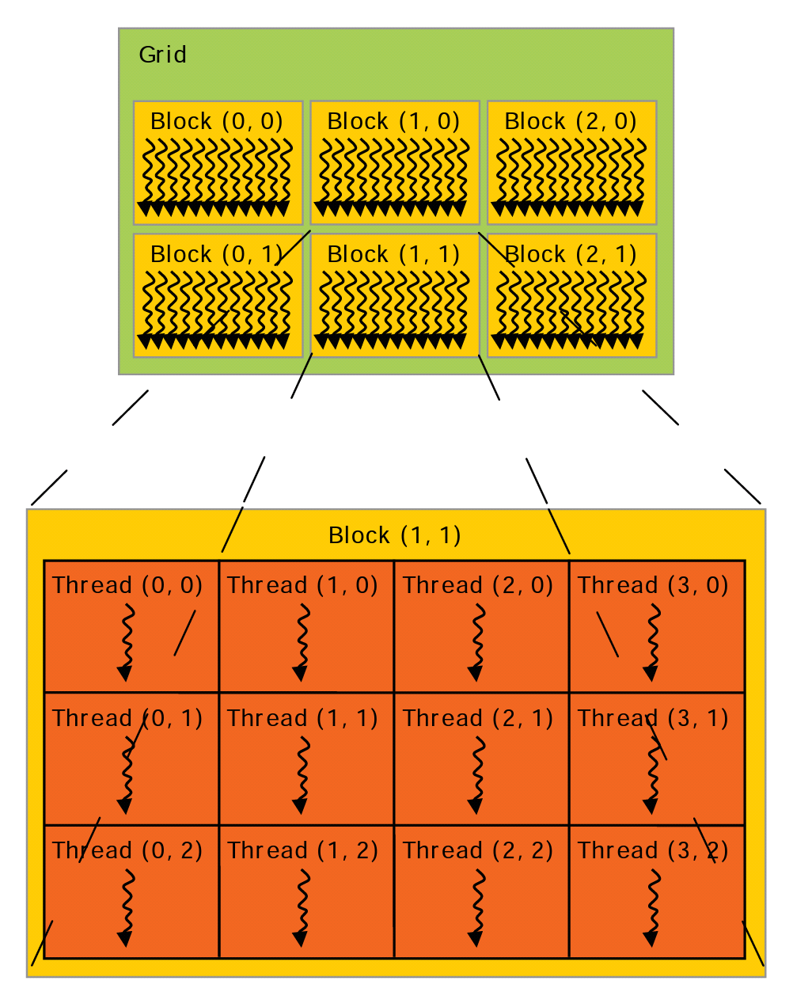

# Linear Combination with CUDA


I got the idea of linear combination from NTU\'s Hongyi Lee\'s Linear Algebra course.
In the video of course, Mr.Lee shows that he use the linear combination to combine two images.
So in this post, I will show how to use CUDA do linear combination on GPU.

## Linear Combination and C Implement

If you do not know what is linear combination, you might need to search this concept on the Internat with your favourite search engine.
The sequence implement on CPU is

```c
for (int i = 0; i < size; ++i)
  c[i] = coe1 * a[i] + coe2 * b[i];
```

The operation is simple, but the computation might cost a lot of times.

The real implement can be fount at my repo on [GitHub](https://github.com/Qinka/random-cuda/blob/585f4c91f05a93d03e8f43bbfdf364028e98d027/learn-cuda/source/linear-combination.cc).

```c
int linearCombination(float coe1, uint8_t* m1, float coe2, uint8_t* m2, int size, uint8_t* m3) {
  for (int i = 0; i < size; i++) {
    float tmp = coe1 * m1[i] + coe2 * m2[i];
    m3[i] = (uint8_t)(fmaxf(fminf(tmp,255),0));
  }
  return 0;
}
```

## CUDA and GPU

The parallel can make computation faster. For a CUDA-supported GPGPU, there are many core to do computing.
So we can use many core to compute at once.

### Kernel

So we first define a kernel of computing:

```c++
__global__
void linearCombinationKernel(float coe1, uint8_t* m1, float coe2, uint8_t* m2, int size, uint8_t* m3) {
  int idxX = blockIdx.x * blockDim.x + threadIdx.x;
  int stdX = blockDim.x * gridDim.x;
  for(int i = idxX; i < size; i += stdX) {
    float tmp = coe1 * m1[i] + coe2 * m2[i];
    m3[i] = (uint8_t)(fmaxf(fminf(tmp,255),0));
  }
}
```

The prefix `__global__` mark the function can be call from *host* and run on the *device*.
The *host* means the CPU, and *device* means GPU.
`blockDim`, `blockIdx`, `gridDim`, and `threadIdx` are the index for CUDA's block and thread.
The computing model of CUDA is shown as following image.

When computing a kernel, there is a grid. For each grad, there will be many blocks in it, and there are many threads in each block.
The each thread can be regard as a core.
`blockDim.x` denotes the number of thread in a block with x direction, and `gridDim.x` denotes the number of block in a grid with x direction.
So there will be `blockDim.x * gridDim.x` threads, and the stride of index will be it.

By the way the functions in that code, such as `fmaxf` and `fminf`, will be transformed to GPU's code not CPU's.

### Calling function

We can call the function with the following codes:
```c++
linearCombinKernel<<<128,128>>>(coe1,dm1,coe2,dm2,_size,dm3);
```

In the `<<<>>>` notation, the size of blocks, and threads(per block) will be set up for the kernel function.
The program can be executed parallelly. The maximum of number of thread is 1024, and the maximum of number of block is about 2 billion(for CUDA 8.0 or earlier is 65535),
but some of GPU's core is less than 1024. That means if you set the size of blocks and threads to 1024, but your GPU only have 1024 core
there will not be 1024 * 1024 cores run at one time.

### Memory allocating and copying

The kernel function will run on GPU, and it can "only" access the memory on GPU. So we need copy the data from host to device's memory,
and copy the data from device to host after computing is finished.
Meanwhile we need allocate some spaces in GPU's memory to store them.

We can use `cudaMalloc()` to allocate a space on GPU, while we can use `cudaMemcpy()` to copy the memory between host and device.
There is an example:
```c++
cudaMalloc((void**)&d_a,sz_a);
cudaMemcpy(d_a,p_a,sz_a,cudaMemcpyHostToDevice);
// calling kernel
cudaMemcpy(p_a,d_a,sz_a,cudaMemcpyDeviceToHost);
cudaFree(d_a);
```

The `sz_a` is the size of data in bytes. `cudaMemcpyDeviceToHost` and `cudaMemcpyHostToDevice` tell function `cudaMemcpy()` the destination and source.

### Error

Most CUDA's function will return the status of error.
The type of status is `cudaError_t`.

A common way to handle it might be:
```c++
cudaError code;
code = cudaXXX(...);
if (code != cudsSuccess) {
  // handler of error 
}
```


### Full version of code

The following is the full version of codes:

```c++
__global__
void linearCombinationKernel(float coe1, uint8_t* m1, float coe2, uint8_t* m2, int size, uint8_t* m3) {
  int idxX = blockIdx.x * blockDim.x + threadIdx.x;
  int stdX = blockDim.x * gridDim.x;
  for(int i = idxX; i < size; i += stdX) {
    float tmp = coe1 * m1[i] + coe2 * m2[i];
    m3[i] = (uint8_t)(fmaxf(fminf(tmp,255),0));
  }
}

int linearCombination(float coe1, uint8_t* m1, float coe2, uint8_t* m2, int _size, uint8_t* m3) {
  uint8_t* dm1 = 0;
  uint8_t* dm2 = 0;
  uint8_t* dm3 = 0;
  cudaError_t rtCode;
  int blocksize;
  int threadsPerBlock;
  size_t size = _size * sizeof(uint8_t);
  int bsX = 0;

  // select codes
  /*rtCode = cudaSetDevice(0);
  if (rtCode != cudaSuccess) {
    fprintf(stderr, "cudaSetDevice failed!  Do you have a CUDA-capable GPU installed?");
    goto Error;
    }*/

  // get prop
  cudaDeviceProp prop;
  rtCode = cudaGetDeviceProperties(&prop,0);
  if (rtCode != cudaSuccess) {
    fprintf(stderr, "Fail to get the device infos");
    goto Error;
  }

  // malloc
  rtCode = cudaMalloc((void**)&dm1, size);
  if (rtCode != cudaSuccess) {
    fprintf(stderr, "cudaMalloc failed!(m1)");
    goto Error;
  }
  rtCode = cudaMalloc((void**)&dm2,size);
  if (rtCode != cudaSuccess) {
    fprintf(stderr, "cudaMalloc failed!(m2)");
    goto Error;
  }
  rtCode = cudaMalloc((void**)&dm3, size);
  if (rtCode != cudaSuccess) {
    fprintf(stderr, "cudaMalloc failed!(m3)");
    goto Error;
  }

  // copy
  rtCode = cudaMemcpy(dm1, m1, size, cudaMemcpyHostToDevice);
  if (rtCode != cudaSuccess) {
    fprintf(stderr, "cudaMemcpy failed!(m1)");
    goto Error;
  }
  rtCode = cudaMemcpy(dm2, m2, size, cudaMemcpyHostToDevice);
  if (rtCode != cudaSuccess) {
    fprintf(stderr, "cudaMemcpy failed!(m2)");
    goto Error;
  }

  // run

  bsX = (int)(_size + prop.maxThreadsPerBlock - 1) / prop.maxThreadsPerBlock;
  blocksize = min(prop.maxGridSize[0],bsX);
  threadsPerBlock = min(prop.maxThreadsPerBlock,_size);
  fprintf(stderr,"size: %d, %d\n",blocksize,threadsPerBlock); 
  linearCombinKernel<<<dim3(blocksize),dim3(threadsPerBlock)>>>(coe1,dm1,coe2,dm2,_size,dm3);

  // check error
  rtCode = cudaGetLastError();
  if (rtCode != cudaSuccess) {
    fprintf(stderr, "addKernel launch failed: %s\n", cudaGetErrorString(rtCode));
    goto Error;
  }

  // synchronize
  rtCode = cudaDeviceSynchronize();
  if (rtCode != cudaSuccess) {
    fprintf(stderr, "cudaDeviceSynchronize returned error code %d after launching addKernel!\n", rtCode);
    goto Error;
  }

  // copy
  rtCode = cudaMemcpy(m3, dm3, size, cudaMemcpyDeviceToHost);
  if (rtCode != cudaSuccess) {
    fprintf(stderr, "cudaMemcpy failed!(m3),%d",rtCode);
    goto Error;
  }

Error:
    cudaFree(dm1);
    cudaFree(dm2);
    cudaFree(dm3);
    return rtCode;
}
```


## Testing

I test this function with many computer in different CUDA SDK, and different GPU.

I ran that function 1000 times, for each test case, and combined two array, each of which include 1 million elements.

| Platform                            | avg time(us) | min time(us) | max time(us) |
|-------------------------------------|--------------|--------------|--------------|
| Windows 10, CUDA 9.1, GTX1050       |       98.374 |       97.762 |       99.390 |
| Windows 10, CUDA 9.1, K1100M        |       388.07 |       360.26 |       405.95 |
| Ubuntu 17.04, CUDA 9.1, GTX960      |       71.537 |       71.142 |       72.678 |
| Ubuntu 16.04, CUDA 8.0, GTX Titan X |       29.031 |       25.953 |       29.760 |

